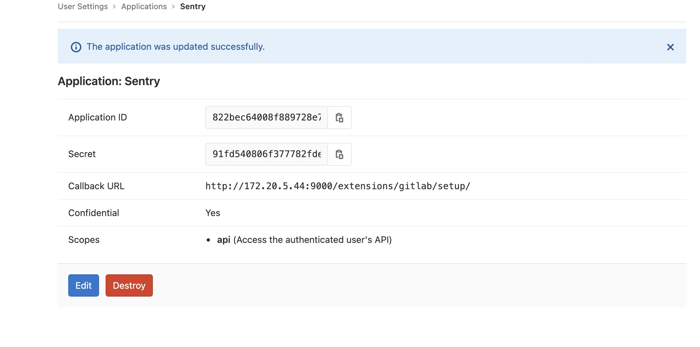
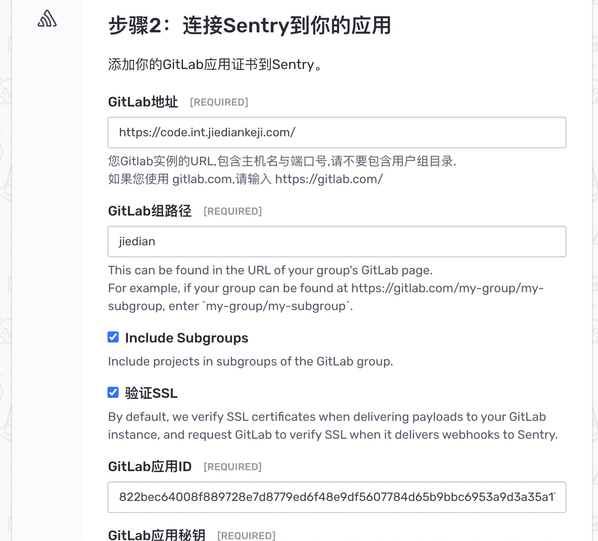

# Sentry 部署过程（基于 docker）

sentry back-end server: http://172.20.5.44:9000/

dev部署方式： html层使用script标签引入

pub/线上部署方式： 在构建流程使用sentry-cli进行版本控制


## Sentry 介绍：

[Sentry](https://sentry.io/)是一个开源的实时错误追踪系统,可以帮助开发者实时监控并修复异常问题。它主要专注于持续集成、提高效率并且提升用户体验。

Sentry 分为服务端和客户端 SDK，前者可以直接使用它家提供的在线服务，也可以本地自行搭建；后者提供了对多种主流语言和框架的支持，包括 React、Angular、Node、Django、RoR、PHP、Laravel、Android、.NET、JAVA 等。同时它可提供了和其他流行服务集成的方案，例如 GitHub、GitLab、bitbuck、heroku、slack、Trello 等。

### 通过老版 SDK 使用 Sentry：

[Raven.js](https://docs.sentry.io/clients/javascript/usage/)是 Sentry 的官方浏览器 JavaScript 客户端。它会自动报告从浏览器环境触发的未捕获的 JavaScript 异常，并提供丰富的 API 来报告错误。

#### 安装：

```bash
npm install raven-js --save
```

####  使用：

- 1. 在客户端配置 DSN（Data Source Name）

```JavaScript
const DSN = "https://examplePublicKey@o0.ingest.sentry.io/0";
Raven.config(DSN).install();
```

- 2. 使用时机/方式：

1. 全局（app 外监控全局未捕获异常）

配置好 DSN 后，推荐在 app 入口处使用*Raven.context*可以全局捕获所有 uncaught exception。

```JavaScript
Raven.context(function() {
  initMyApp();
});
```

2. 手动上报

   - 使用<font color = 'red'>_Raven.captureException_</font>进行异常的的上报
   - 使用<font color = 'red'>_Raven.captureMessage_</font>进行信息的上报

在 <font color = 'red'>_try-catch_</font> 包裹住想要检测的代码块，并使用<font color = 'red'>_Raven.captureException(e)_ </font> 发送错误到服务器。

p.s:这里的*异常 e 需要在 throw 的时候抛出一个 Error 对象*，这样服务器端才能正确的解析。

```JavaScript
try {
  doSomething(a[0]);
} catch (e) {
  Raven.captureException(e);
}
```

<font color = 'red'>_Raven.captureMessage_</font>通常直接上传某种字符串，形式如下：

```JavaScript
try {
  doSomething(a[0]);
} catch (e) {
  Raven.captureMessage('an error occured.');
}
```
3. 通过Sentry-Cli

通过npm安装

```bash
npm install @sentry/cli
```
通过sentry-cli可以通过命令行配置release，便于版本控制。
```bash
sentry-cli releases deploys "$VERSION" new -e ENVIRONMENT
```
另外可以通过sentry-cli直接发送事件：

```bash
sentry-cli send-event -m "Hello from Sentry"
```
- 3.  使用 <font color = 'red'>_context/wrap_</font>

<font color = 'red'>_context_</font> 形式如下：

```JavaScript
Raven.context(function() {
  doSomething(a[0]);
});
```

本质是封装了一个 <font color = 'red'>_try-catch_</font> 的函数，该函数是封装时*立即执行*的。

<font color = 'red'>_wrap_</font> 形式如下：

```JavaScript
const wrappedFn = Raven.wrap(function() {
  doSomething(a[0]);
});
wrappedFn();
```

作用与 <font color = 'red'>_context_</font>一致，区别在于返回的是一个*非立即执行的函数*。

- 上传附带额外的信息:

<font color='#AFF'>_captureMessage ,captureException, context, wrap_</font>都支持携带额外的信息上传，已 Context 为例子我们上传的额外信息的的类型有如下三种：

- <font color = 'red'>_Raven.setUserContext_</font>
- <font color = 'red'>_Raven.setTagsContext_</font>
- <font color = 'red'>_RavensetExtraContext_</font>

其中每一种都可以通过如下三种方式配置：

- setXXXContext*全局进行设置(即所有信息上报时都会携带对应的*Context\*信息)
- Raven.context({...params},fn)的方式进行局部设置
- 通过*配置文件*在 <font color = 'red'>_Raven.config()_</font>进行设置

<font color = 'red'>_Raven.setUserContext_</font>可以附带*user*的信息，一般在*SPA(Single Page Application)*中，存在用户*login/logout* 的情况下使用。形式如下：

```JavaScript
Raven.setUserContext({
 email: "matt@example.com",
 id: "123",
});
```

<font color = 'red'>_Raven.setTagsContext_</font>可以附带*tags*的信息。*tags*是堆*key-value*的信息，可用于服务端对异常的索引和搜索。在服务器端的 UI 界面中，我们还可以看到*图形化的标签*对每个异常进行了的分类。*tag*的使用形式如下：

```JavaScript
Raven.setTagsContext({ key: "value" });
```

<font color = 'red'>_Raven.setExtraContext_</font>用于附带额外的自定义参数，支持最大*200KB*的参数内容，形式如下：

```JavaScript
Raven.setExtraContext({ foo: "bar" });
```

上述所有类型的*Context*携带额外信息的方式在删除不想要的信息时需要注意以如下方式进行删除：(以*extraContext*为例子)

```JavaScript
const context = Raven.getContext();
const extra = { ...context.extra };
delete extra["FieldKeyToDelete"];
Raven.setExtraContext();
Raven.setExtraContext(extra);
```

-  4. 使用 <font color = 'red'>_BreadCrumb_</font>

<font color = 'red'>_BreadCrumb_</font>是浏览器和应用程序生命周期的一系列事件捕获，通俗的讲就是 BreadCrumb 是记录 Sentry 捕获事件（_event_）前的一系列活动，方便监控人员对事件的发生进行更详细的了解。这些活动包括：

- XMLHttpRequests
- URL / address bar changes
- UI clicks and keypress DOM events
- console log statements
- previous errors

在使用 Raven SDK 的情况下，可以使用<font color = 'red'>_Raven.captureBreadcrumb_</font>捕获一个 <font color = 'red'>_BreadCrumb_</font>数据，使用方式如下：

```JavaScript
Raven.captureBreadcrumb({
 message: "Item added to shopping cart",
 category: "action",
 data: {
   isbn: "978-1617290541",
   cartSize: "3",
 },
});
```

该数据结构一共支持以下几种 key 的配置：<font color='#AFF'>_type, category, message, level, timestamp , data_</font>。

### 通过新版 SDK 使用 Sentry：

[@sentry/browser](https://docs.sentry.io/platforms/javascript/)是新版的 在浏览器环境下的JavaScript的SDK，老版的特性都包含，使用方式类似。下面将介绍以下新版的 SDK 的使用方式。

#### 安装：

```bash
npm install @sentry/browser --save
or
yarn add @sentry/browser
```

支持[懒加载](https://docs.sentry.io/platforms/javascript/install/lazy-load-sentry/)。

####  使用：

- 1. 初始化与配置

```JavaScript
import * as Sentry from '@sentry/browser'
Sentry.init({
  dsn: "https://examplePublicKey@o0.ingest.sentry.io/0",
  maxBreadcrumbs: 50,
  debug: true,
});
```

支持以环境变量或配置文件<font color='#AFF'>_（~/.sentryclirc）_</font>作为初始化参数，可支持的配置项见[configs](https://docs.sentry.io/platforms/javascript/configuration/options/)。

- 2. hub和scope

Hub的指的是当前当前sentry初始化后创建的一个全局中心点（一个线程会关联一个Hub，用来将event路由发送到sentry）。Hub创建后会有创建若干scope，可以理解为子集关系。
scope提供了一个相对隔离的环境用来组合event和当前scope中的额外信息，当事件被捕获并发送到sentry时，sentry会把当前scope的额外信息都合并在一起。例如（Context、breadCrumbs等）。
详情见[Hub&Scope](https://docs.sentry.io/platforms/javascript/enriching-events/scopes/)

- 3. 新的Context、Tag、Breadcrumbs等附加到event的方式

全局设置：
```Javascript
Sentry.setContext("character", {
  name: "Mighty Fighter",
  age: 19,
  attack_type: "melee",
});

```

捕获时设置：（支持
tags, extra, contexts, user, level, fingerprint）

```Javascript
Sentry.captureException(new Error("something went wrong"), {
  tags: {
    section: "articles",
  },
});

```
捕获时显式清除当前scope的信息并重新设置：
```Javascript
Sentry.captureException(new Error("clean as never"), scope => {
  scope.clear();
  scope.setTag("clean", "slate");
  return scope;
});
```
通过scope实例对象设置：（会被merge到全局scope中）
```Javascript
const scope = new Sentry.Scope();
scope.setTag("section", "articles");
Sentry.captureException(new Error("something went wrong"), scope);
```
覆盖全局scope：
```Javascript
const scope = new Sentry.Scope();
scope.setTag("section", "articles");
Sentry.captureException(new Error("something went wrong"), （）=>scope);
```

局部调用设置：（发送后scope会被重置为原来的scope）

```JavaScript
 Sentry.withScope(function(scope) {
  scope.setUser(someUser);
  Sentry.captureException(error);
});
```

移除当前scope额外内容：
```JavaScript
Sentry.configureScope(scope => scope.clear());
```


- 4. 上传附件

sentry支持上传附件的功能，支持最大 100MB 的文件上传。[这里](https://docs.sentry.io/platforms/javascript/enriching-events/attachments/)有一个详细的例子可以参考。

- 5. 用户反馈
sentry提供了一个函数能够生成一个弹窗用于填写用户的反馈。举个例子我们可以在beforeSend的钩子函数里进行用户反馈：
```JavaScript
    function beforeSend(event, hint) {
      if (event.exception) {
        Sentry.showReportDialog({ eventId: event.event_id });
      }
      return event;
    }
```


## 部署（前端部分）：
### 通过CDN（dev测试中使用的方式）：

可以直接使用sentry提供的默认的一种引入方式 [Sentry JS Loader](https://docs.sentry.io/platforms/javascript/install/lazy-load-sentry/)，引入sentry包，但是配置不够灵活只能在html模版层进行sentry的额外配置。详情见[Sentry JS Loader](https://docs.sentry.io/platforms/javascript/install/lazy-load-sentry/）


更加符合实际的方式是使用[webpack](
webpackwebpack.js.org
)打包sentry的初始化过程，上传到CDN，前端通过在html中引入文件的方式即可使用:

```html
<script src='your-CDN-URL'>
```
缺点：无法使用sentry的[release模式](https://docs.sentry.io/platforms/javascript/configuration/releases/)。

### gitLab 集成

Sentry 支持很多服务的集成，包括<font color='#AFF'>_Github, Gitlab, Slack,Redmine_</font>等。详情参考[Sentry 集成](https://docs.sentry.io/product/integrations/)。集成 Sentry 的优点：

[Sentry Integrations 优点](https://docs.sentry.io/product/integrations/integration-platform/#faq)

下面以 Gitlab 为例介绍。

1. 在 GitLab 中新建一个 application

在 UserSettings 中 application 中，依次填写以下信息：

```
Name: Sentry
Redirect URI: http://172.20.5.44:9000/extensions/gitlab/setup/
Scopes: api
```

填写完成后拿到如下信息： 

2. 在 SentryServer 端链接 gitLab

在打开 SentryServer，这里我们的 Server 地址为：_172.20.5.44:9000_。在界面中依次选择：<font color='#AFF'>settings-->integrations-->GitLab</font>。然后安装插件，按照提示进行到第二步，分别填写 GitLab 实例的 url，GitLab 的组的 url，第一步拿到的 Application ID 和 Secret。如下所示： 

然后设置 GitLab -> Admin area -> Settings -> Network -> Outbound requests -> Allow requests to the local network from hooks and services<font color='#AFF'>（_需要 GitLab root 权限_）</font>

除了上述已有的发布的第三方集成服务，sentry还支持自定义集成：
公有集成和私有集成。公有集成（public integration）以Oauth方式进行认证后，通过Sentry暴露的Webhook等进行sentry与自定义服务的通信。而私有集成没有Oauth认证过程，有一个创建集成后即生成的token使用。可以通过将token写入.env文件，在自定义的后端服务中集成sentry。[Internal Integrations](https://blog.sentry.io/2019/11/21/customize-your-sentry-workflow-a-sample-internal-integration)是一个私有集成的例子。

## 部署（docker部分）：

### 依赖：
Docker 19.03.6+

Compose 1.24.1+

8 GB RAM

20 GB Free Disk Space

clone [Sentry-Self-Hosted-Server](https://github.com/getsentry/onpremise)到服务器环境，进入到项目文件夹中运行脚本：
```Bash
./install.sh
```
安装前可以根据需要配置一些环境变量，主要在这三个文件中:

```text
config.yml
sentry.conf.py
.env
```
sentry的event超过90天默认会清理掉，设置清理时间可以在.env中设置：
```text
SENTRY_EVENT_RETENTION_DAYS
```
如果不需要清理服务，可以在<font color='#AFF'>docker-compose.yml</font>  中删除 <font color='#AFF'>sentry-cleanup</font> 服务。


